# Raphael Sander

## 1. :school: Formação Acadêmica

Tecnólogo em Gestão de Telecomunicações no [Instituto Nacional de Telecomunicações](https://inatel.br/home/)

## 2. :tongue: Idiomas

- Português (Nativo)
- Inglês (intermediário, escrita e conversação com experiência em projetos internacionais)
- USK Callan - Módulo XII (completo)
- [Duolingo (Inglês)](https://www.duolingo.com/profile/RaphaelSander?via=share_profile)

## 3. :mortar_board: Certificados

### 3.1. Cyber Security

- Pentest Profissional (Desec)
- Pentest Profissional (DCPT) (Desec)
- Criptografia 0x65 (Desec)
- Introdução à Lei Brasileira de Proteção de Dados Pessoais (Escola Nacional de
Administração Pública ENAP)
- Segurança em Tecnologia da Informação (Fundação Bradesco)

### 3.2. DevOps

- Fundamentos de Agilidade: seus primeiros passos para a transformação ágil (Alura)
- Kubernetes: Pods, Services e ConfigMaps (Alura)
- Kubernetes: Deployments, Volumes e Escalabilidade (Alura)
- Jenkins e Docker: Pipeline de Entrega Contínua (Alura)
- Terraform: Automatize a Infraestrutura na Nuvem (Alura)
- Ansible: sua infraestrutura como código (Alura)
- Infraestrutura como código: preparando máquinas na AWS com Ansible e Terraform

### 3.3. Dev

- Python 3 Parte 1: Introdução à Nova Versão da Linguagem (Alura)

### 3.4. TI

- Gestão Estratégica de TI - ITIL (Fundação Bradesco)

## 4. :computer: Conhecimentos

Os "conhecimentos" são áreas que atuei em minha carreira sem ter de fato um
curso ou certificado oficial.
Foi aprendizado sob demanda.

### 4.1. DevOps

- Jenkins
- Docker
- Docker Compose
- Kubernetes
- Helm
- Ansible
- Vagrant
- Terraform
- AWS (EC2)

### 4.2. TI

- Redes
- Linux

### 4.3. Virtualização

- Proxmox (KVM)
- VMWare
- VirtualBox

### 4.4. Telecom

- Open5GS
- Adva Disagregate Router OS
- Amarisoft Simbox E
- Sunwave 5G Solution
- Parallel Wireless 4G Solution
- Wireshark (protocolos 5G e 4G)

### 4.5. Dev

- Python
- Git (BitBucket, GitHub e Gerrit)
- C++
- C (Arduino, ESP8266, ESP32)
- Bash Script

### 4.6. Cyber Security

- Pentest

## 5. :books: Livros

- Poder da Execução de Metas
- O Monge e o Executivo
- LGPD (FIESP)
- Os Segredos da Mente Milionária
- 14 Hábitos de Desenvolvedores Altamente Produtivos
- O Cérebro com Foco e Disciplina
- O Poder do Hábito
- Stephen Hawking - Breves Respostas para Grandes Questões
- Programação Web com Node.JS (5%)
- Scrum e Métodos Ágeis (6%)
- O Poder do Carisma (46%)
- Python - The Bible (21%)
- Pai Rico Pai Pobre (38%)
- Mongo DB para Iniciantes (65%)

## 6. :ticket: Eventos

<table>
    <tr>
        <td>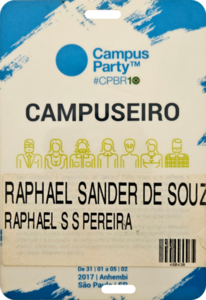 </td>
        <td>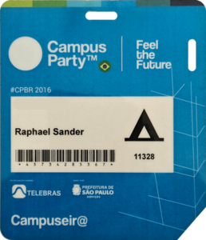</td>
        <td>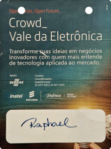</td>
    </tr>
    <tr>
        <td>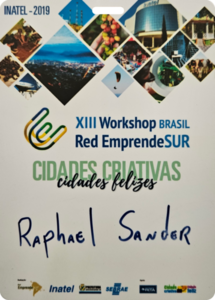</td>
        <td></td>
        <td>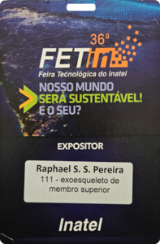</td>
    </tr>
    <tr>
        <td></td>
        <td>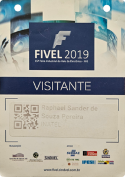</td>
        <td>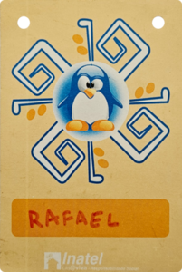</td>
    </tr>
    <tr>
        <td>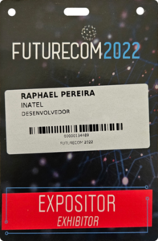</td>
        <td>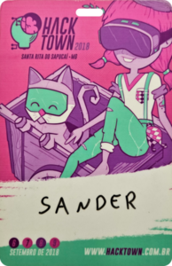</td>
        <td>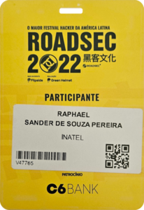</td>
    </tr>
    <tr>
        <td>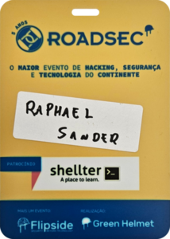</td>
        <td>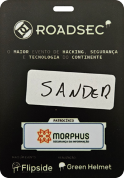</td>
        <td>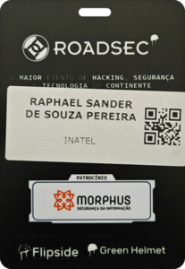</td>
    </tr>
</table>

*Keep learning.*

[LinkedIn](https://www.linkedin.com/in/raphael-sander-96a362a6/)
